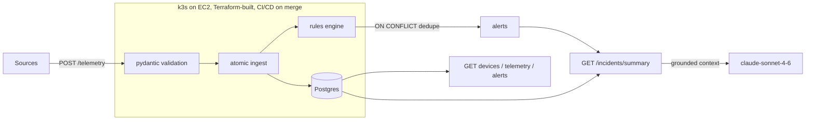

# FleetPulse
**Live demo:** http://app.63.176.86.97.nip.io/docs
> Real-time event monitoring with a grounded LLM copilot and a tool-using ops agent; demo domain: IoT device fleet.


FleetPulse is a small production-style event-monitoring platform, demonstrated on an IoT
device fleet: sources report telemetry to a FastAPI backend, a rules engine raises alerts,
and an LLM copilot plus a tool-using Ops Agent turn a noisy alert window into a grounded,
plain-language incident summary. It runs on Kubernetes, is provisioned with Terraform, and
deploys itself from GitHub Actions on every merge.

**Domain-agnostic by design.** The architecture (event ingestion, rules, alerts, grounded
summaries, an auditable agent) has no domain; devices are the demonstration dataset. The
same platform monitors transactions, servers, orders, or claims: swap the noun, keep the
architecture.

## Status / roadmap

- [x] **P0 — Scaffold**: FastAPI skeleton, ruff + mypy + pytest, pre-commit, CI
- [x] P1 — Core API: models, migrations, ingest, rules engine, seeder
- [x] P2 — Docker + local Kubernetes (k3s via Rancher Desktop)
- [x] P3 — Terraform + cloud k3s (live URL)
- [x] P4 — CI/CD: build, push, deploy on merge
- [x] P5 — Grounded LLM incident summariser (`/incidents/summary`, cites alert ids, mocked-seam tests)
- [x] P6 — Observability: request IDs, JSON logs, one error shape, Prometheus `/metrics`, API-key gate
- [ ] P7 — Ops Agent: tool-use loop, approval-gated writes, run tracing
- [ ] P8 — Agent evals + MCP server

## Quickstart

```bash
python3.12 -m venv .venv && source .venv/bin/activate
make install
cp .env.example .env   # add your ANTHROPIC_API_KEY (or skip: /incidents/summary returns 503)
make db-up
make migrate
make seed              # demo fleet with planted anomalies
make run               # http://localhost:8000/docs
make lint test
```

## Try the AI layer

The summariser reads the live alert window and writes an operator briefing that cites
device names and alert ids, and invents nothing (see `SYSTEM_PROMPT` in
`app/services/summarize.py`):

```bash
curl -s http://app.63.176.86.97.nip.io/incidents/summary | python3 -m json.tool
```

Returns 503 when no `ANTHROPIC_API_KEY` is configured; tests mock at the network seam,
so CI runs green with no key and no network.

## Architecture



Telemetry batches enter through `POST /telemetry`, are validated at the edge (pydantic),
ingested atomically (SQLAlchemy/Postgres), and evaluated by a rules engine that raises
deduplicated alerts, race-proofed by a partial unique index. Kubernetes runs it all
(probes, secrets, ingress); Terraform builds the node it runs on. On top of the alert
window, `GET /incidents/summary` assembles a token-frugal context (open alerts, per-device
aggregates, silent devices) and has claude-sonnet-4-6 write a grounded briefing: the
substrate the P7 agent will investigate with.

Every request carries an `X-Request-ID` (accepted or minted), is logged as one JSON line,
and is counted in Prometheus metrics at `/metrics`, labeled by route template rather than
raw path to keep label cardinality bounded. Errors share one envelope:
`{"error": {"code", "message", "request_id"}}`.

## Design decisions

- **Alert dedupe via partial unique index + `ON CONFLICT DO NOTHING`**, not savepoints:
  one declarative round trip; two concurrent batches cannot double-alert.
- **Flush before rules, commit once**: the rules engine sees the batch inside the same
  transaction; the world sees all of it or none of it.
- **PostgreSQL idioms accepted on purpose** (`ON CONFLICT`, `DISTINCT ON`): JSONB already
  married the project to PG, so it uses PG well; portable alternative documented (window
  functions).
- **The pipeline owns the image field**: deploys are SHA-pinned by CI; humans do not run
  `kubectl set image`. Manual applies would un-pin to `:latest` and fight the pipeline.
- **Grounding means controlled retrieval**: SQL assembles the context, the model narrates
  it and cites alert ids; the prompt forbids inventing data, and the silent-device list
  lets the summary catch what the rules miss.
- **Keyless is a working mode**: without `ANTHROPIC_API_KEY` the endpoint degrades to 503;
  tests mock at the network seam, so CI never touches the internet. Cost-bearing endpoints
  sit behind an optional `X-API-Key` gate for the day the URL is public.

## Observability at a glance

```bash
curl -si http://app.63.176.86.97.nip.io/healthz | grep -i x-request-id
curl -s  http://app.63.176.86.97.nip.io/metrics | head -5
```
